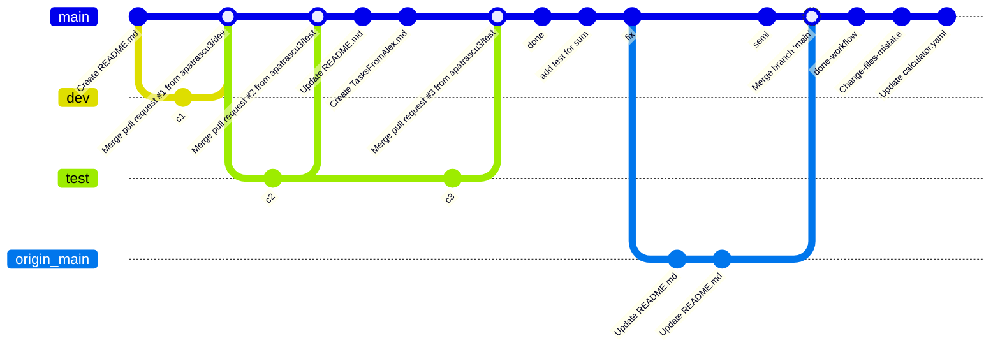

# training newhire 1

 - DEV-033 Team Work with Git and Continuous Integration: https://luxoft.csod.com/ui/lms-learning-details/app/event/bda5eae0-5c36-4bb1-91c0-506739cdf086

 - DEV-007 Introduction to Git https://luxoft.csod.com/ui/lms-learning-details/app/event/78f536c6-97c7-4686-9388-a127f9dbf0d9

 - Graphics: https://mermaid.js.org/syntax/classDiagram.html

 - course: https://luxoft.csod.com/phnx/driver.aspx?routename=Learning/Curriculum/CurriculumPlayer&TargetUser=144407&curriculumLoId=e5daefcb-76cf-47d9-b1ee-5ab060ceca51&referrerUrl=https%3a%2f%2fluxoft.csod.com%2fui%2flms-learning-details%2fapp%2fcurriculum%2fe5daefcb-76cf-47d9-b1ee-5ab060ceca51

### DOCUMENTATION 

### Understanding the Git Graph

This graph represents the workflow and branching strategy used during the training:

* **Feature Branches (`dev` and `test`):** Separate branches were created to work on specific tasks safely. Once the work was completed, they were integrated back into the `main` branch via **Pull Requests** (PR #1, PR #2, and PR #3).
* **Local vs. Remote Synchronization (`main` vs. `origin/main`):** * I created a new commit (`semi`) on my local `main` branch but did not push it to the server yet.
  * Meanwhile, I updated the `README.md` file directly on the **GitHub web interface**. This added new commits to the remote branch (`origin/main`).
  * When I tried to push my local `semi` commit to GitHub, Git required me to pull the remote changes first.
  * The pull operation downloaded the web updates to my local machine and automatically generated a **Merge Commit** locally. This safely combined the remote web updates with my local `semi` commit. 
  * Finally, the resulting merged history was successfully pushed back to the remote server.

     

